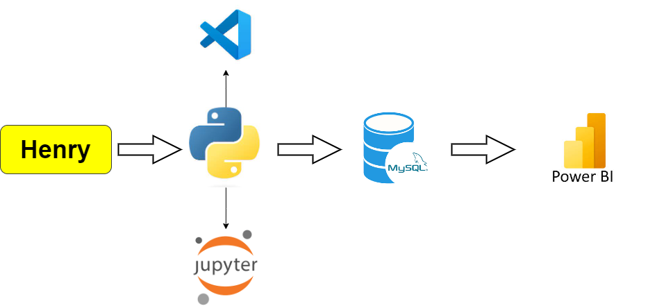

# PI_3_Data_Analytics 
This milestone is the final individual Data Science project proposed by **Henry**  its target is to group programming and analytical concepts viewed during the Bootcamp.

On the provided source data set proposed to apply to cleanse and transform programming methods to optimize records for later uploading to a relational query program **MYSQL** and create a database.

Finally, by using a powerful visualization tool such as Power BI I have created an informative **Dashboard** where I will show my analytical skills developed through the course getting some insights from data.

## Topic: Air Plane Crashes

## Work Flow

&emsp; &emsp; 

## Built With

- Python libraries: Pandas, MySql, Power BI

- Jupyter notebook

- VSCode

 &ensp;  &emsp;  &ensp;  &ensp;  &ensp; 

## Prerequisites

- Knowledge about Pandas Python, Workbench MySql, Power BI

## Authors

👤 **Leon Yohel Espitia**

- GitHub: [@Leon-Espitia](https://github.com/Leon-Espitia)
- Twitter: [@LenEspitia1](https://twitter.com/LenEspitia1)
- LinkedIn: [leon-espitia](https://www.linkedin.com/in/leon-espitia/)

## 🤝 Contributing

Contributions, issues, and feature requests are welcome!

## Show your support

Give a ⭐️ if you like this project!
